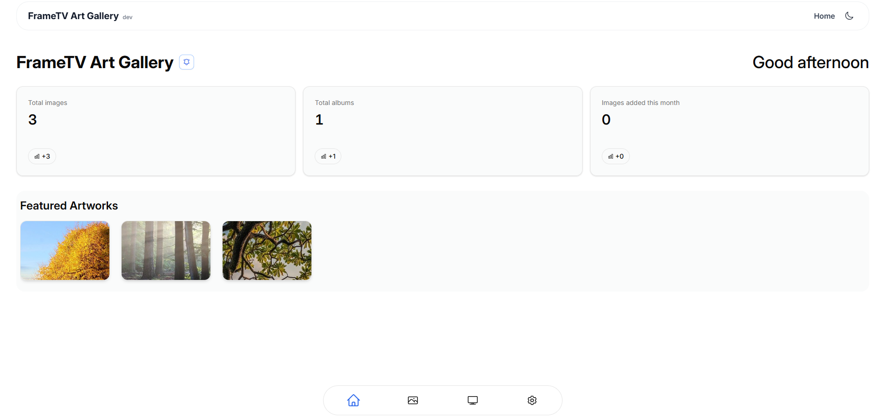
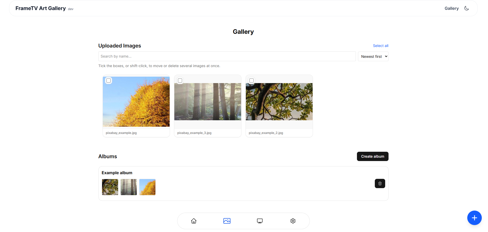
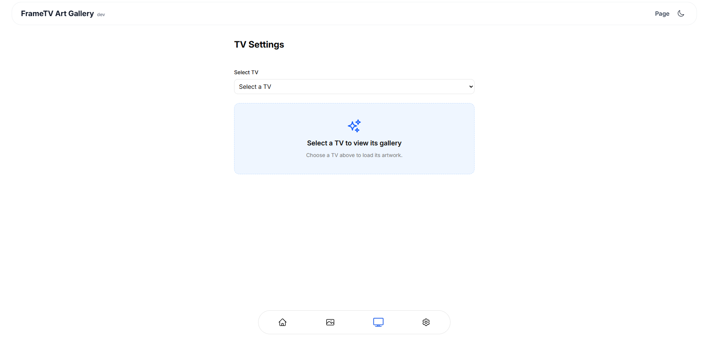

<picture>
  <source media="(prefers-color-scheme: light)" srcset="https://raw.githubusercontent.com/mrtncode/frametv-art-gallery/refs/heads/main/docs/header_new.png">
  <source media="(prefers-color-scheme: dark)" srcset="https://raw.githubusercontent.com/mrtncode/frametv-art-gallery/refs/heads/main/docs/header_dark_new.png">
  <!-- Default fallback -->
  
</picture>


# frametv-art-gallery

[](https://github.com/mrtncode/frametv-art-gallery/releases/latest) 
[](https://github.com/mrtncode/frametv-art-gallery/actions/workflows/build_image.yaml) 
[](https://github.com/mrtncode/frametv-art-gallery/blob/main/LICENSE) 
[](https://www.python.org/) 
[](https://github.com/mrtncode/frametv-art-gallery/stargazers)


frametv-art-gallery is an independent, open-source, self-hosted gallery manager for Samsung Frame TVs. Not affiliated with Samsung. It lets you create and manage a personal gallery of images, photos, or artworks locally on your TV.

<p align="center">
  <picture>
    <source media="(prefers-color-scheme: dark)" srcset="https://readme-typing-svg.demolab.com?font=Impact&size=30&center=true&duration=6000&pause=1000&color=FFFFFF&vCenter=true&width=800&lines=Frame+TV+Art+Gallery;Start+easily+with+Docker+on+your+homeserver;Or+just+use+the+desktop+app+for+your+PC;Manage+your+images+%3A%29">
    <source media="(prefers-color-scheme: light)" srcset="https://readme-typing-svg.demolab.com?font=Impact&size=30&duration=6000&pause=1000&color=000000&center=true&vCenter=true&width=800&lines=Frame+TV+Art+Gallery;Start+easily+with+Docker+on+your+homeserver;Or+just+use+the+desktop+app+for+your+PC;Manage+your+images+%3A%29">
    
  </picture>
</p>

## Features
- **Immich Integration**: Direct import images from your Immich instance or local storage.
- **Multi-Device**: Control and broadcast to multiple Frame TVs across your network.
- **Easy Playback**: Cast any photo or classic artwork to your TV in a single click.
- **Organized Collections**: Group artworks into custom albums and digital exhibits.
- **Responsive UI**: Full mobile support with automatic dark/light mode switching.
- **Offline/ privacy First**: Entirely local communication via native Samsung WebSocket protocols.
- **Open Source**: Fully open-source and community-driven, with no hidden tracking or telemetry.
- **Docker Support**: Easy deployment with Docker and Docker Compose.
- **Desktop App**: Frametv-art-gallery is also available as a desktop app for Windows, MacOS, and Linux. Download it under the [releases](https://github.com/mrtncode/frametv-art-gallery/releases)


## Images
You can use any kind of image! Either upload your own personal photos or import them from Immich. Or download copyright-free artwork from the internet and import it into Frame TV Gallery.

## App Screenshots
<p align="center">
  
  <br / >
  
  
</p>
The UI is also available in dark mode and is fully responsive for mobile devices.
Gallery example images from https://pixabay.com/

# Installation

## Docker
docker volume create frametv_uploads
docker volume create frametv_db

docker run -d \
  --name frametv \
  -v frametv_uploads:/app/uploads \
  -v frametv_db:/app/instance \
  -p 8000:8000 \
  ghcr.io/mrtncode/frametv-art-gallery:latest

Or use the **docker-compose.yml** file: https://github.com/mrtncode/frametv-art-gallery/blob/main/docker-compose.yml

# Update
## Docker (docker run)
Pull the latest image and restart the container while keeping your data (persists in volumes)

Docker Compose (recommended):
1. `docker compose pull`
2. `docker compose up -d`

# Configuration

All optional, with sensible defaults. Set them as environment variables on the container.

| Variable | Default | What it does |
| --- | --- | --- |
| `GUNICORN_WORKERS` | `4` | Worker processes. More than one keeps a slow TV from blocking the whole app. |
| `GUNICORN_TIMEOUT` | `180` | Seconds before gunicorn kills a worker. Keep it above `FRAME_TV_UPLOAD_DEADLINE`. |
| `FRAME_TV_SOCKET_TIMEOUT` | `8` | Socket timeout for a single read from the TV. |
| `FRAME_TV_CALL_DEADLINE` | `20` | Seconds a normal TV request may take before it is given up on. |
| `FRAME_TV_UPLOAD_DEADLINE` | `120` | Same, for image uploads, which push the whole file to the TV. |
| `FRAME_TV_PAIRING_TIMEOUT` | `45` | How long adding a TV waits for the pairing prompt to be accepted. |
| `FRAME_TV_DOWN_COOLDOWN` | `30` | Seconds a TV is skipped after it failed to answer. |
| `FRAME_TV_BUSY_WAIT` | `90` | How long a deliberate action queues behind another operation on the same TV. |
| `FRAME_TV_MAX_PARALLEL_CALLS` | `8` | Concurrent TV requests per worker. |

## Disclaimer (important!)

frametv-art-gallery Disclaimer

frametv-art-gallery is an unofficial, fun, open-source project and is **not affiliated with, endorsed by, or sponsored by Samsung** (or any other company). It is provided "as is" and use is entirely at your own risk. 

This project uses local websocket APIs provided by the TVs.

> ⚠️ **Security Warning:** This application does **not** implement authentication, authorization, or other hardening controls. It is intended for **private, local network use only**.
>
> - Do **not** expose this service to the public internet.
> - Do **not** run it on a publicly reachable IP/host without adding your own security layer (VPN, reverse proxy auth, firewall rules, etc.).
> - If you want to access it remotely, put it behind a secure tunnel or VPN and ensure only trusted devices can reach it.

> ⚠️ **No Warranty and Liability:** The author assumes **no liability** for any damages, data loss, device malfunction, or any other issues that may arise from using this application. You use frametv-art-gallery **entirely at your own risk**. The software is provided without any warranties, express or implied. 
>
> **Always create backups of your data before updating** to a new version. While we strive to maintain compatibility, updates may introduce breaking changes or require data migrations. You are responsible for ensuring you have a complete backup of your uploads and database before proceeding with any update. unofficial, fun, open-source project and is **not affiliated with, endorsed by, or sponsored by Samsung** (or any other company). It is provided "as is" and use is entirely at your own risk. 

## Architecture


# Tests

```
pip install -e ".[test]"
pytest
```

# Troubleshooting

## The TV gallery shows placeholders instead of thumbnails

The TV stopped answering. Every request to a TV is given a deadline, and a TV that misses
it is skipped for `FRAME_TV_DOWN_COOLDOWN` seconds so one silent set cannot tie up the
whole app — the page then falls back to whatever thumbnails are already cached on disk.

A Frame TV serves a single art channel, so requests to one TV are serialised: opening a
second connection while another is still being established makes the set reject both. The
whole page of thumbnails is fetched in one round trip for the same reason.

Deliberate actions (playing an image, deleting one, uploading) ignore that cooldown and
still try, so the TV waking up is noticed immediately. If it persists, check that the TV is
on and reachable, then look for a single `Timeout after …` line in the logs: the skipped
requests that follow are deliberately silent.

## The TV auto-discovery does not find my TV
Make sure that:
- Your TV is on and connected to the same network as the server.
- Your TV is connected to the same subnet as the server. Some routers isolate Wi-Fi and wired networks, or different VLANs, which prevents discovery.
- You use network="host" mode in Docker. Discovery uses UDP broadcast, which is not supported in bridge mode.

## "The TV is busy with another request"

Something else was talking to that TV — most often a page of thumbnails still loading,
which holds the set for far longer than a single request. A deliberate action queues for
`FRAME_TV_BUSY_WAIT` seconds before giving up; nothing was changed on the TV, so retrying
once the other operation has finished is all it needs.

## Errors when uploading images to the TV:

-> Check that the TV is on and has enough free storage space. When the storage space for art images is full, the upload fails. 

-> Try uploading an image with the SmartThings App. There will appear a more specific error message.


## The TV keeps asking for permission when uploading an image

Some TVs are asking for permission every time, to avoid this, go to:

Device Connection Manager > Access Notification Settings > First Time Only


# Techstack
Frontend:
- React.js
- TailwindCSS
- Shadcn/ui
- Lottie Animation 

https://lottiefiles.com/free-animation/image-VXYNYReCmq -> Thanks!

Backend:
- Flask (Python)

# Credits
Speical thanks to https://github.com/xchwarze/samsung-tv-ws-api